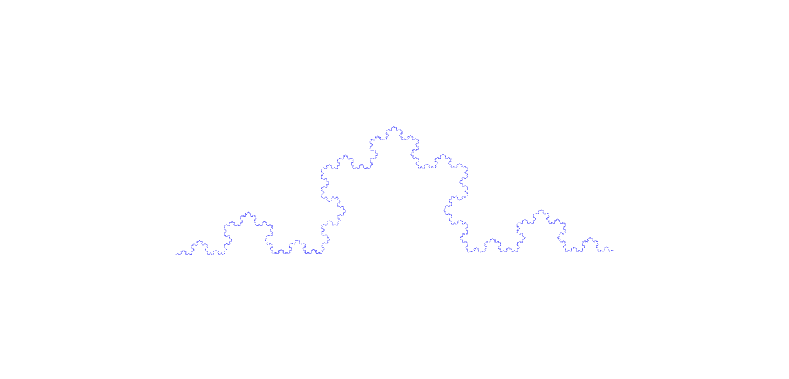

# SageMathFractals
You will find different SageMath (Jupyter notebooks) and Python files  for different fractals drawings.
### Constructed with L-Systems
- **Sierpiński triangle**
  - angle = $\displaystyle\frac{2\pi}{3}$
  - **variables** : $F\ G$
  - **axiom** : $F+G+G$
  - **rule** : $(F \rightarrow F+G-F-G+F) , (G \rightarrow GG)$
  - **constants** : $+\ -$

- **Koch curve**
  - angle = $\displaystyle\frac{\pi}{3}$
  - **variables** : $F$
  - **axiom** : $F$
  - **rule** : $(F \rightarrow F+F--F+F)$
  - **constants** : $+\ -$

| iterations = 1        | iterations = 2      | iterations = 7 |
:-------------------------:|:-------------------------:|:-------------------------:
  |   | 
